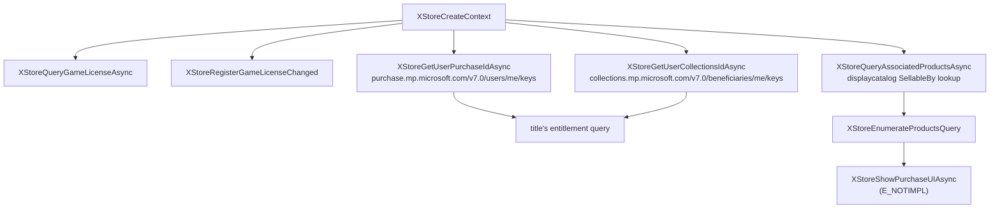

# Store and purchase flow

How a title's GDK store calls are answered, what works today, and what does not.

## The path a title takes



The two store-ID routes are not spelled alike - purchase is `users/me/keys` where collections is `beneficiaries/me/keys` - and each 404s on the other's path. A title fetches both, then hands the pair to its own backend as `purchase_token` / `collections_token`; they are opaque signed blobs that xodus never interprets.

## Store-ID keys

`XStoreGetUserPurchaseIdAsync` and `XStoreGetUserCollectionsIdAsync` are backed by real calls to the endpoints above, minted by `xodus-service` through the B2B route with relying party `http://mp.microsoft.com/`.

These endpoints reject a plain compact MSA ticket (`t=`) with HTTP 401:

```
RpsExceptionCode: UnexpectedTicketType
"The ticket that was provided is not a Compact_Delegation ticket"
```

A `urn:passport:delegationcompact` (`d=`) ticket is only granted to a caller authenticated by the Windows identity broker, which xodus is not and cannot become. The B2B route sidesteps the requirement entirely, so no delegation ticket is needed. Both endpoints answer 200, and `POST …/transaction/redeem` - which previously failed `Failed to validate CollectionsMsIdKey` - now succeeds.

A key that cannot be minted is reported as `E_ACCESSDENIED`, never as `S_OK` with an empty buffer. An empty key that claims success is worse than a failure: a title reads a 1-byte result (the NUL alone), treats it as a real key, and fails later somewhere less obvious.

## Catalog queries

`XStoreQueryAssociatedProductsAsync` resolves the running package's `PackageFamilyName` to a `ProductId` and then lists the products "sellable by" it, via displaycatalog's `SellableBy` lookup.

**That lookup paginates, and ignores `$top`.** It answers a fixed six raw products per request regardless of the page size asked for, then applies `actionFilter` to that page. `HasMorePages` and `TotalResultCount` both overcount, because they answer for the unfiltered set - an empty run of pages is the only trustworthy terminator. `get_associated_products` therefore walks every page via `$skip`, sixteen requests in flight per wave, deduplicating by `ProductId`.

This matters more than it sounds. Minecraft's associated-product set runs to ~157 entries, and the Realms subscriptions its "Choose your plan" screen prices - `CFQ7TTC0KXR8` (Plus) and `CFQ7TTC0KXT4` (Core), both `ProductKind` `PASS` - sit about a hundred pages in. Answering with the first page alone gives the picker four products, none of them a subscription, and no price to show.

The DLL does not forward the title's `maxItemsToRetrievePerPage` as a cap. `XStoreProductsQueryHasMorePages` always answers "no more pages", so the single response is everything the title will ever see; capping it at the title's page size would truncate the catalog permanently. `AssociatedProductsRequest.max_items` is a cap on products returned, and zero - what the DLL sends - means "no cap".

An empty `currency_code` yields an empty price string rather than a bare `0.00` that would read as free. That is the correct answer for a product the catalog listed with no purchasable availability, and it is load-bearing: a blank price is exactly what a storefront checks for.

`XStoreQueryProductsAsync` prices an explicit list of `StoreId`s and is implemented, but titles that discover their catalog through the associated-products query never call it.

## Why the Realms plan picker showed "Couldn't access platform store"

Minecraft's UI is a JavaScript bundle, and its plan picker renders that dialog from a state named `show-prices-not-loaded`, reached when the product query has *finished* and a subscription price string is empty. It is the empty-price branch. Despite its wording it is not a store-reachability error, says nothing about sign-in state, and is not raised by any GDK call failing.

It was caused by the pagination gap above: the subscriptions were never in the answer, so both prices stayed empty. With the full page walk the picker renders Core at $3.99/month and Plus at $7.99/month with a working free-trial button.

The picker's spinner has a hardcoded 15-second timeout, so a slow answer looks identical to a missing one. Store latency is not usually what fills it - on a measured launch the catalog crawl took 1.6 s and the store-ID plus entitlement phase 1.5 s, against 8.4 s in between where the title made no store calls at all.

Two claims that were previously recorded here and are wrong:

- `XStoreRegisterGameLicenseChanged` returning `E_NOTIMPL` does **not** make a title report that the platform store is unavailable. It was a real defect and is implemented, but it was never what produced that dialog.
- `XPackageGetUserLocale` returning `E_NOTIMPL` was likewise a real defect, likewise fixed, and likewise not the cause.

## Unimplemented: `XStoreShowPurchaseUIAsync`

Buying from the in-game Marketplace does nothing: the title reaches the buy UI and calls `XStoreShowPurchaseUIAsync`, which returns `E_NOTIMPL`. In a full session this is the only stub the title hits. Self-contained, and the last thing between a working storefront and a completed purchase.

## Note on diagnostics

Store-ID keys and MSA tickets are bearer credentials. Diagnostic logging on these paths deliberately records only lengths, the `t=`/`d=` kind prefix, and the service's own error text - never token material.

## A note on instrumenting titles

A title need not import `xgameruntime.dll` at all; GDK entry points can be reached indirectly through the `query_api` GUID tables. The practical consequence is that **the absence of a log line proves nothing unless that entry point actually has a `diag!`**. Two store entry points were assumed dead for exactly this reason and turned out to be doing real work. When an API "is never called", check that it can log before concluding anything.
